<picture>
  <source media="(prefers-color-scheme: dark)" srcset="assets/hero-dark.svg">
  <source media="(prefers-color-scheme: light)" srcset="assets/hero-light.svg">
  
</picture>

  
  
  

  
  
  
  
  
  
  
  
  
  
  
  
  
  
  
  
  
  
  
  
  
  
  
  
  
  
  
  
  
  
  
  
  
  
  
  

<picture>
  <source media="(prefers-color-scheme: dark)" srcset="https://raw.githubusercontent.com/ProximaCA/ProximaCA/output/vitals-dark.svg">
  <source media="(prefers-color-scheme: light)" srcset="https://raw.githubusercontent.com/ProximaCA/ProximaCA/output/vitals-light.svg">
  
</picture>

<picture>
  <source media="(prefers-color-scheme: dark)" srcset="https://raw.githubusercontent.com/ProximaCA/ProximaCA/output/snake-dark.svg">
  <source media="(prefers-color-scheme: light)" srcset="https://raw.githubusercontent.com/ProximaCA/ProximaCA/output/snake-light.svg">
  
</picture>

  
  
  

